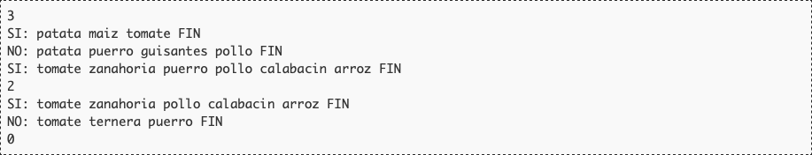
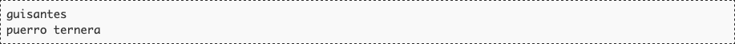

# Potitos

"¡Javi! ¡Parece que éste tampoco le gusta!" se convirtió en cantinela habitual a la hora de la comida, antes de que el pequeño dejara definitivamente de comer potitos una tarde. Darle de comer era misión imposible; pese a la paciencia de sus padres, el niño había heredado el carácter cabezón del padre y mantenía la boca cerrada, inmune a los vuelos de la cucharita y a las monerías de quienes le rodeaban. Era necesario encontrar una solución.

Se les ocurrió que, quizá, el aparentemente caprichoso rechazo a los potitos se debía a algún ingrediente concreto. Comenzaron a anotar, cuidadosamente, todos los ingredientes de cada potito que le daban, junto con un comentario de si el pequeño se lo había tomado o no. Tras varios días, estaban convencidos de que podrían averiguar cuáles eran los ingredientes que no le gustaban, y así comprar aquellos potitos que fuera a comerse. ¿Puedes ayudarles a encontrarlos?

## Entrada

La entrada estará compuesta de múltiples casos de prueba. Cada uno comienza con un número indicando el número de potitos que se han intentado dar al bebé (como máximo 25).

A continuación aparece una línea por cada potito. La línea comienza por SI: o NO: dependiendo de si el pequeño se comió o no el potito. Después aparece la lista de los ingredientes del potito separados por espacios. La lista se cierra con la palabra FIN, que no debe considerarse un ingrediente. Ningún potito tiene más de 10 ingredientes, y todos los ingredientes están compuestos por una única palabra de hasta 20 letras minúsculas.

La entrada acaba con un caso de prueba sin potitos.

## Salida

Para cada caso de prueba se deben mostrar, en una línea, los ingredientes que no le gustan al niño, ordenados alfabéticamente y separados por espacio. Si todos los ingredientes le gustan, se dejará la linea en blanco.

## Entrada de ejemplo

## Salida de ejemplo

## Lenguaje empleado

	

---

[🛜 Aquí puedes encontrar el sitio web oficial donde se encuentra este reto.](https://aceptaelreto.com/pub/problems/v001/85/st/statements/Spanish/index.html)